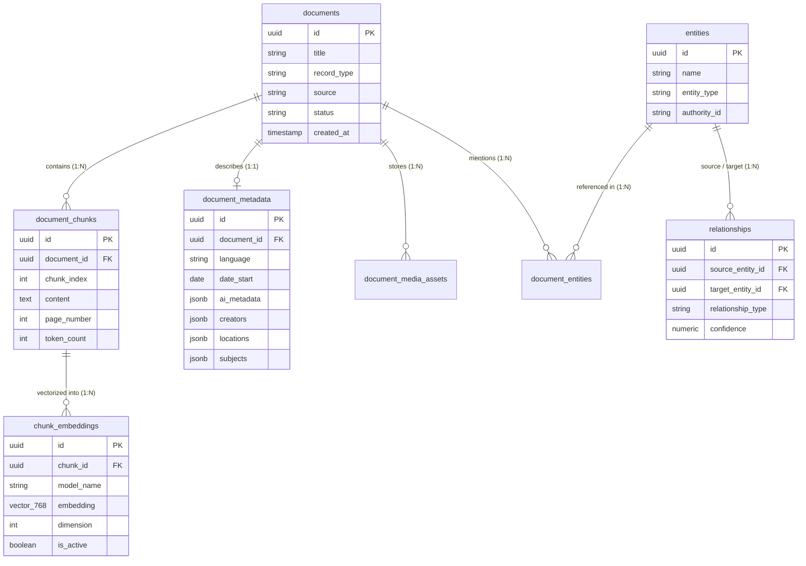
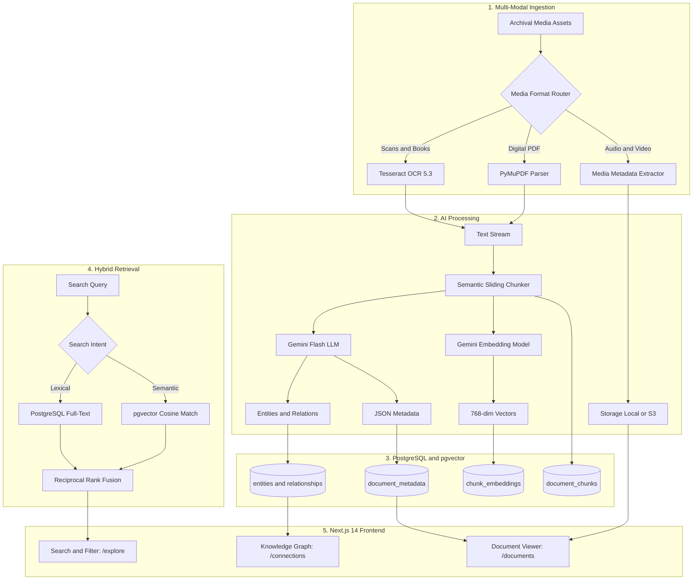

# System Architecture & Technology Stack Specification

**Project**: Intelligent Historical Knowledge Archive  
**Version**: 1.0.0 (Production Release)  
**Date**: September 21, 2026  
**Status**: Verified & Operational  

---

## 1. Executive Architecture Overview

The **Intelligent Historical Knowledge Archive** is an end-to-end, multi-modal knowledge platform designed for preserving, analyzing, and discovering historical cultural assets across six primary media types: **Manuscripts, Books, Maps, Audio Recordings, Photographs, and Videos**.

Unlike traditional digital archives that rely on brittle keyword search and static file storage, this system implements a **decoupled, multi-tier architecture** that couples dense AI neural embeddings with a relational Knowledge Graph and automated OCR/AI enrichment pipelines.

```
┌────────────────────────────────────────────────────────────────────────┐
│                        PRESENTATION TIER (UI)                         │
│   Next.js 14 App Router • TypeScript • Custom Glassmorphism System     │
│   - Global Search & Filter (/explore)    - Entity Knowledge Graph      │
│   - Archival Document Viewer (/documents) - Self-Service Deposit Portal │
└───────────────────────────────────┬────────────────────────────────────┘
                                    │ HTTP / JSON API (Port 3000 -> 8000)
                                    ▼
┌────────────────────────────────────────────────────────────────────────┐
│                        APPLICATION TIER (API)                          │
│               FastAPI (Python 3.11) • Uvicorn • Pydantic v2            │
│   - Hybrid Search Engine (RRF)           - Graph Traversal Service     │
│   - Multi-Signal Recommendation Engine    - Streaming Media Controller  │
│   - Ingestion & OCR Processing Pipeline  - Repository Health & Stats   │
└───────────────────┬────────────────────────────────┬───────────────────┘
                    │                                │
                    ▼                                ▼
┌──────────────────────────────────────┐  ┌──────────────────────────────┐
│        AI & COGNITIVE SERVICES       │  │   PERSISTENCE & VECTOR TIER  │
│ - Google Gemini (gemini-flash-lite)  │  │ - PostgreSQL 16 Engine       │
│ - Dense Embeddings (768-dim Vectors) │  │ - pgvector (v0.8.0) Ext.     │
│ - Tesseract OCR 5.3 Engine           │  │ - SQLAlchemy 2.0 Async       │
│ - PyMuPDF Text & Chunking Processor  │  │ - Alembic Migrations         │
└──────────────────────────────────────┘  │ - Object Storage (Local/S3)  │
                                          └──────────────────────────────┘
```

---

## 2. Comprehensive Technology Stack

### 2.1. Frontend Tier (Web Presentation)
| Technology | Version | Purpose & Implementation Details |
|---|---|---|
| **Next.js** | 14.2.35 | Modern React framework with App Router architecture, Server-Side Rendering (SSR), and dynamic client components. |
| **TypeScript** | 5.5.3 | Strict type contracts across all client models, API response payloads, and search state management. |
| **CSS Architecture** | Custom / Vanilla CSS | Bespoke dark-mode glassmorphic theme, CSS variables for design tokens, zero external CSS bloat. |
| **Lucide Icons** | 0.417.0 | Clean, lightweight icon suite for archival metadata, status indicators, and media types. |
| **API Integration** | Next.js Rewrites | Integrated client proxy forwarding `/api/:path*` to the FastAPI backend with zero CORS issues. |

### 2.2. Backend Tier (Application Server & Business Logic)
| Technology | Version | Purpose & Implementation Details |
|---|---|---|
| **FastAPI** | 0.111+ | High-performance async ASGI web framework providing sub-millisecond route handling and dependency injection. |
| **Pydantic** | v2.8+ | Strict runtime request/response validation, schema serialization, and automatic OpenAPI 3.0 generation. |
| **Uvicorn** | 0.53.0 | Lightning-fast ASGI production web server worker with async event loop. |
| **Python** | 3.11.9 | Core programming language leveraging modern asynchronous syntax (`async`/`await`), type annotations, and task concurrency. |

### 2.3. Database & Vector Persistence Tier
| Technology | Version | Purpose & Implementation Details |
|---|---|---|
| **PostgreSQL** | 16.12 | Enterprise relational database guaranteeing ACID compliance for documents, metadata, entities, and relationships. |
| **`pgvector`** | 0.8.0 | Native PostgreSQL extension for storing high-dimensional mathematical vectors and running cosine similarity search (`<=>`). |
| **SQLAlchemy** | 2.0.31 | Modern object-relational mapping (ORM) with full async engine support (`asyncpg`) and connection pooling. |
| **Alembic** | 1.13.2 | Database migration orchestrator tracking versioned schema evolution (including migration `002_vector_768_dim`). |
| **Storage Abstraction** | Custom Engine | Pluggable interface providing local zero-copy file streaming and AWS S3 cloud adapter support. |

### 2.4. AI, Machine Learning & Document Intelligence Tier
| Component | Provider / Library | Purpose & Implementation Details |
|---|---|---|
| **Generative LLM** | Google Gemini (`gemini-flash-lite-latest`) | High-speed LLM for extracting structured metadata, historical eras, creator attribution, and named entities from raw text. |
| **Dense Embeddings** | Google Gemini (`gemini-embedding-001`) | Generates native 768-dimensional float32 vector embeddings capturing latent semantic meaning of text chunks. |
| **OCR Engine** | Tesseract OCR (v5.3.4) + `pytesseract` | Optical Character Recognition for digitizing historical printed broadsides, scanned letters, and archival manuscripts. |
| **Document Parsing** | PyMuPDF (`fitz` v1.24) | High-speed extraction of text, font attributes, and page layouts from digitized historical PDF volumes. |
| **Semantic Chunking** | Custom Sliding Chunker | Token-aware segmenter dividing long historical transcripts into 500-token windows with 50-token contextual overlaps. |

---

## 3. Data Architecture & Relational Schema

The database model is normalized into **10 core tables** engineered for relational integrity and vector similarity:



---

## 4. Key Subsystem Workflows

### 4.1. Automated Ingestion & Enrichment Pipeline
1. **Asset Ingestion**: File deposited via UI or automated connector (e.g. Internet Archive API).
2. **Text Extraction & OCR**: Plain text extracted natively; scanned pages run through Tesseract OCR.
3. **Semantic Chunking**: Text divided into discrete chunks with contextual token overlap.
4. **AI Entity & Metadata Extraction**: Gemini LLM analyzes content to produce structured JSON metadata (dates, organizations, historical period) and named entities.
5. **Dense Vectorization**: Chunks sent to Gemini Embedding API; 768-dim float vectors written directly into `chunk_embeddings` via `pgvector`.
6. **Knowledge Graph Synthesis**: Extracted entities and relationships are linked into the global graph.

### 4.2. Hybrid Search with Reciprocal Rank Fusion (RRF)
When a user performs a search, the system executes two parallel queries:
1. **Sparse Keyword Query**: Standard PostgreSQL full-text matching for exact historical terms, dates, and names.
2. **Dense Semantic Query**: Vector cosine similarity (`<=>`) against `chunk_embeddings` to capture conceptual matches even when keywords differ.
3. **Reciprocal Rank Fusion**:
   $$\text{RRF Score}(d) = \sum_{m \in \{\text{Keyword}, \text{Vector}\}} \frac{w_m}{k + \text{Rank}_m(d)}$$
   Yields unified, bias-free search rankings with contextual AI snippets.

### 4.3. Graph Proximity Recommendation Engine
Related documents are identified through a tripartite hybrid scoring algorithm:
- **Semantic Distance**: Vector similarity between document chunk centroids.
- **Shared Entities**: Overlap of common historical figures and places.
- **Topical Alignment**: Jaccard similarity of subject taxonomy.

---

## 5. Deployment & Production Topology

- **Containerized Stack**: Fully configured via `docker-compose.yml` supporting instant portability across AWS ECS, Google Cloud Run, Azure Container Apps, or bare-metal VMs.
- **WSL2 / Local Development**: Seamless development environment bridging native Windows tools with Linux PostgreSQL 16 + pgvector daemons.
- **Production Decoupling**: Frontend deployable to global edge CDNs (Vercel / Cloudflare) while the backend container runs on scalable compute nodes with direct database VPC peering.

---

## 6. End-to-End System Flowchart

### 6.1. Visual System Flowchart (Universal View)

```
┌──────────────────────────────────────────────────────────────────────────────────────────────────┐
│                               1. MULTI-MODAL INGESTION & DIGITIZATION                            │
│                                                                                                  │
│   [ Historical Assets: Scanned Manuscripts, PDFs, Audio Recordings, Photographs, Videos ]        │
│                                           │                                                      │
│                     ┌─────────────────────┴─────────────────────┐                                │
│                     ▼                                           ▼                                │
│           [ Scanned Documents ]                       [ Audio / Video Newsreels ]                │
│                     │                                           │                                │
│                     ▼                                           ▼                                │
│          { Tesseract OCR 5.3 }                        { Media Metadata Extractor }               │
│                     │                                           │                                │
│                     ▼                                           ▼                                │
│             [ Clean Text Stream ]                      [ Storage: Local / S3 ]                   │
└─────────────────────┬───────────────────────────────────────────┬────────────────────────────────┘
                      │                                           │
                      ▼                                           │
┌────────────────────────────────────────────────────────┐        │
│          2. AI PROCESSING & FEATURE EXTRACTION         │        │
│                                                        │        │
│   [ Semantic Sliding Chunker: 500w / 50 overlap ]      │        │
│                     │                                  │        │
│         ┌───────────┴───────────┐                      │        │
│         ▼                       ▼                      │        │
│   { Gemini Flash LLM }   { Gemini Embedding Model }    │        │
│         │                       │                      │        │
│         ├─► Extracted Entities  └─► 768-dim Vectors    │        │
│         ├─► Graph Relations                            │        │
│         └─► Structured JSON Metadata                   │        │
└─────────────────────┬──────────────────────────────────┘        │
                      │                                           │
                      ▼                                           │
┌─────────────────────────────────────────────────────────────────┴────────────────────────────────┐
│                        3. PERSISTENCE LAYER (PostgreSQL 16 + pgvector)                           │
│                                                                                                  │
│   ┌────────────────────┐   ┌────────────────────┐   ┌────────────────────┐   ┌─────────────────┐ │
│   │ document_metadata  │   │  entities & links  │   │   relationships    │   │ document_chunks │ │
│   │ (JSONB Attributes) │   │ (People, Places)   │   │ (Graph Edges)      │   │ & pgvector (768)│ │
│   └────────────────────┘   └────────────────────┘   └────────────────────┘   └─────────────────┘ │
└──────────────────────────────────────────────┬───────────────────────────────────────────────────┘
                                               │
                                               ▼
┌──────────────────────────────────────────────────────────────────────────────────────────────────┐
│                             4. HYBRID RETRIEVAL & SEARCH ENGINE                                  │
│                                                                                                  │
│                     [ Incoming Search Query (e.g. "Lincoln Civil War") ]                         │
│                                           │                                                      │
│                     ┌─────────────────────┴─────────────────────┐                                │
│                     ▼                                           ▼                                │
│          { Sparse Full-Text Match }                  { Dense pgvector Cosine }                   │
│          PostgreSQL BM25 Index                       768-dim Vector Distance                     │
│                     │                                           │                                │
│                     └─────────────────────┬─────────────────────┘                                │
│                                           ▼                                                      │
│                      [ Reciprocal Rank Fusion (RRF Algorithm) ]                                  │
│                                           │                                                      │
│                                           ▼                                                      │
│                   [ Multi-Signal Recommendations & Graph Proximity ]                             │
└───────────────────────────────────────────┬──────────────────────────────────────────────────────┘
                                            │
                                            ▼
┌──────────────────────────────────────────────────────────────────────────────────────────────────┐
│                           5. PRESENTATION TIER (Next.js 14 Glassmorphism)                        │
│                                                                                                  │
│     • /explore      ──► Real-time Hybrid Search Results, Facet Filters & AI Context Snippets     │
│     • /documents/:id ──► Multi-Modal Archival Viewer, Extracted Entities & Metadata Inspector     │
│     • /connections  ──► Interactive Dynamic Knowledge Graph Network (Nodes & Typed Edges)       │
└──────────────────────────────────────────────────────────────────────────────────────────────────┘
```

---

### 6.2. Interactive Mermaid Diagram



