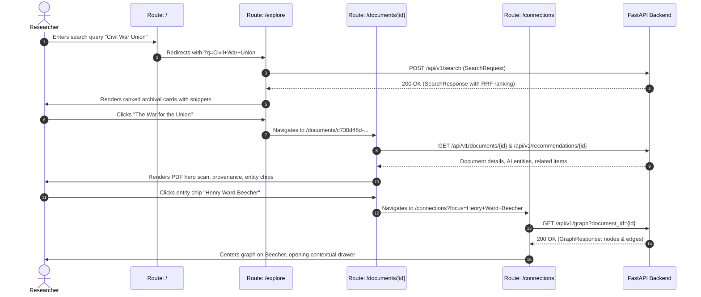

# Archival Discovery & Research Platform: UI Wireframe & UX Architecture

**Product**: Intelligent Historical Archive & Knowledge Discovery Engine  
**Phase**: Phase 01 — Wireframe & Information Architecture (Design Blueprint)  
**Status**: Ready for Design Review  
**Companion Document**: [API_UI_MAPPING.md](file:///c:/Users/lenovo/OneDrive/Desktop/intelligent-historical-archive/frontend/API_UI_MAPPING.md)  

---

## 1. Product Experience & UX Philosophy

### 1.1. Core Identity
The Intelligent Historical Archive is designed at the intersection of four disciplines:
```
┌─────────────────────────────────────────────────────────────┐
│                      EDITORIAL ARCHIVE                      │
│            (Typographic dignity, curation, voice)           │
│                             +                               │
│                    MODERN RESEARCH TOOL                     │
│         (Precision filters, dense search, provenance)       │
│                             +                               │
│                    AI-ASSISTED DISCOVERY                    │
│     (Vector semantics, entity extraction, relationships)    │
│                             +                               │
│                       DIGITAL MUSEUM                        │
│         (High-resolution assets, contemplation, context)    │
└─────────────────────────────────────────────────────────────┘
```

### 1.2. Anti-Patterns Explicitly Rejected
- **No generic SaaS dashboard**: No arbitrary KPI stat cards, metric charts, or widget grids.
- **No college project look**: No unstyled HTML, mismatched default margins, or bootstrap vibes.
- **No administrative database portal**: No brutalist metadata tables or spreadsheet grids.
- **No generic AI chatbot**: No persistent conversational bubble or hallucinating chat assistant replacing original documents.
- **No corporate software aesthetic**: No cold blue buttons (`#0066FF`), neon purple glows, or heavy synthetic gradients.

### 1.3. The 5-Stage UX Loop

1. **DISCOVER**: The user encounters an intriguing entry point on the homepage via a thematic query, a prominent primary artifact, or an era.
2. **EXPLORE**: The user moves into `/explore`, issuing semantic or keyword searches, adjusting signal weights, and applying archival facets.
3. **UNDERSTAND**: The user enters `/documents/[id]`. The historical document itself is the visual hero, framed by creator context, raw source provenance, and AI-extracted entities.
4. **CONNECT**: The user examines linked historical figures, locations, and events in `/connections` via an interactive knowledge graph.
5. **CONTINUE EXPLORING**: Multi-signal recommendations at the base of every document suggest the next logical historical artifact to inspect.

---

## 2. Design System & Visual Foundation

### 2.1. Color System (Parchment & Archival Ink)
The color palette evokes historical manuscripts, archival boxes, and fine print typography while remaining crisp on high-density OLED and Retina displays.

| Token Name | Hex Code | Purpose & Usage |
|---|---|---|
| `--color-paper-base` | `#FBF9F5` | Primary canvas / background (warm parchment / ivory) |
| `--color-paper-surface` | `#F4EFEA` | Card surfaces, search container, filter panel |
| `--color-paper-elevated` | `#EDE6DD` | Hover states, active filters, dropdown menus |
| `--color-paper-border` | `#E2DACF` | Hairline dividers (1px rules, card outlines) |
| `--color-ink-primary` | `#1A1816` | Display titles, document text, major headlines |
| `--color-ink-secondary` | `#4A4540` | Body copy, search snippets, facet labels |
| `--color-ink-muted` | `#78726A` | Metadata keys, dates, captions, provenance footnotes |
| `--color-accent-oxblood` | `#7A1C1C` | Primary accent (active tab, search button, highlight) |
| `--color-accent-oxblood-subtle` | `#F4E8E8` | Oxblood tint for entity badges, active filter pills |
| `--color-accent-gold` | `#997530` | Archival gold for historical era badges, confidence rings |
| `--color-accent-gold-subtle` | `#F8F3E8` | Background tint for thematic tags |
| `--color-surface-dark` | `#161514` | Deep charcoal for dark sections (viewer stage, graph backdrop) |

### 2.2. Typography Architecture
A two-typeface pairing that establishes clear editorial authority:

1. **Display & Editorial**: `Cormorant Garamond` (or `Instrument Serif`)
   - *Role*: Hero headlines, document titles, archival dates, pull quotes, section introductions.
   - *Characteristics*: High contrast, elegant historical italics, generous letter proportions.
2. **Interface & Research Body**: `Inter` (or `Geist` / `IBM Plex Sans`)
   - *Role*: Navigation, search inputs, metadata labels, filter facet counts, entity chips, buttons.
   - *Characteristics*: Neutral, tall x-height, maximum legibility across varied screen resolutions.

#### Typographic Scale
```text
Display Hero:   48px / 1.15 line-height / Cormorant Garamond / -0.02em tracking
Section Title:  32px / 1.25 line-height / Cormorant Garamond / -0.01em tracking
Document Title: 24px / 1.30 line-height / Cormorant Garamond / normal
Body Large:     18px / 1.60 line-height / Inter / normal
Body Regular:   15px / 1.55 line-height / Inter / normal
UI Caption:     13px / 1.40 line-height / Inter / normal
Metadata Key:   11px / 1.20 line-height / Inter / 0.06em uppercase tracking
Monospace:      12px / 1.40 line-height / JetBrains Mono / IDs, SHA256, checksums
```

### 2.3. Spatial System, Radius & Depth
- **Grid Baseline**: 4px / 8px incremental rhythm (`8px`, `16px`, `24px`, `32px`, `48px`, `64px`, `96px`).
- **Containers**:
  - `max-width: 1400px` for wide-screen research layouts (`/explore`, `/connections`).
  - `max-width: 1140px` for editorial reading layouts (`/`, `/documents/[id]`, `/about`).
- **Corner Radii**:
  - Small: `2px` (hairline badges, tags)
  - Medium: `4px` (buttons, search inputs, document preview cards)
  - Large: `6px` (drawers, modal sheets)
  - *No heavy rounded pills or bubbly radii (`>8px`)* to maintain archival structure.
- **Shadows & Elevation**:
  - `elevation-0`: 1px solid `var(--color-paper-border)` (flat print aesthetic).
  - `elevation-1`: `0 2px 8px rgba(26, 24, 22, 0.04), 0 1px 2px rgba(26, 24, 22, 0.02)` (cards on hover).
  - `elevation-2`: `0 8px 24px rgba(26, 24, 22, 0.08), 0 2px 6px rgba(26, 24, 22, 0.04)` (flyouts, inspector drawers).

---

## 3. Global Information Architecture & Navigation

### 3.1. Route Map
```text
/ ────────────────────── Home / Archive Gateway
├── /explore ─────────── Main Discovery Experience (Unified Search & Filtering)
├── /documents/[id] ──── Document Research View (Hero Scan, Entities, Provenance)
├── /connections ─────── Interactive Knowledge Graph (Entities & Documents)
├── /collections ─────── Archival Source & Thematic Directory
└── /about ───────────── Archive Philosophy, AI Enrichment & Provenance
```

### 3.2. Persistent Navigation Header
The global header is lean, disciplined, and unobtrusive:

```text
┌────────────────────────────────────────────────────────────────────────────────────────────────────────────────────────┐
│  THE INTELLIGENT ARCHIVE    │   Explore   Connections   Collections   About   │  [Search archive...  ⌘K]  │  ● System  │
└────────────────────────────────────────────────────────────────────────────────────────────────────────────────────────┘
```
- **Masthead (Left)**: Minimal wordmark: *The Intelligent Archive* in small-caps serif.
- **Primary Routes (Center)**: Text links with subtle underline on active state.
- **Quick Search (Right)**: Compact trigger opening omnisearch overlay (`⌘K` / `Ctrl+K`).
- **System Indicator (Far Right)**: Subtle dot indicator confirming live PostgreSQL + pgvector connection.

---

## 4. Primary Screen Wireframes

---

### Route 1: `/` (Home / Archive Gateway)

#### Purpose & Experience
A welcoming, editorial gateway that immediately invites discovery without marketing fluff or SaaS gimmickry. Communicates: *"History, connected. Knowledge, discoverable."*

#### Wireframe
```text
┌────────────────────────────────────────────────────────────────────────────────────────────────────────────────────────┐
│  THE INTELLIGENT ARCHIVE    │   Explore   Connections   Collections   About   │  [Search archive...  ⌘K]  │  ● Online  │
├────────────────────────────────────────────────────────────────────────────────────────────────────────────────────────┘
│
│                                           THE INTELLIGENT HISTORICAL ARCHIVE
│                                         A Living Repository of Connected Memory
│
│                       Search across 19th-century speeches, abolitionist manuscripts, civil war records,
│                        and rare cartography through dense semantic understanding and knowledge graphs.
│
│               ┌────────────────────────────────────────────────────────────────────────────────────────┐
│               │ 🔍 Search speeches, correspondents, historical events, or themes...         [Search ↵] │
│               └────────────────────────────────────────────────────────────────────────────────────────┘
│                    Suggested Inquiries:  [Civil War speeches]   [Lincoln public life]   [Abolitionist papers]
│                                          [Swedish historical maps]   [Henry Ward Beecher]
│
│ ──────────────────────────────────────────────────────────────────────────────────────────────────────────────────────
│
│   CURATED ARTIFACTS                                                                        [View All in Explore →]
│
│   ┌───────────────────────────┐  ┌───────────────────────────┐  ┌───────────────────────────┐  ┌─────────────────────┐
│   │ [DOCUMENT SCAN: PDF]      │  │ [HISTORICAL MAP: JPEG]    │  │ [MANUSCRIPT: PDF]         │  │ [BROADSIDE: PRINT]  │
│   │                           │  │                           │  │                           │  │                     │
│   │ 1885 • Speech / Pamphlet  │  │ 18th Century • Cartography│  │ 1861 • Personal Papers    │  │ 1863 • Proclamation │
│   │ The War for the Union     │  │ Karta öfver Sverige       │  │ Letters on Secession      │  │ Emancipation Leaflet│
│   │ Henry Ward Beecher        │  │ Arkivkopia Historical     │  │ Massachusetts Archives    │  │ Boston Print Works  │
│   │                           │  │                           │  │                           │  │                     │
│   │ 4 Chunks • 768d Embedded  │  │ OCR Verified • High-Res   │  │ 12 Entities Linked        │  │ Primary Source      │
│   └───────────────────────────┘  └───────────────────────────┘  └───────────────────────────┘  └─────────────────────┘
│
│ ──────────────────────────────────────────────────────────────────────────────────────────────────────────────────────
│
│   COLLECTION HORIZON                                                                      ARCHIVAL INTEGRITY
│
│   • 2 Curated Repositories (Internet Archive, LoC)                                       • Zero Hallucination Policy
│   • Multi-Format: Books, Maps, Manuscripts, Images                                       • Raw Source Provenance Preserved
│   • Dense Semantic Indexing powered by pgvector (768d)                                   • Relational Knowledge Graph
│
└────────────────────────────────────────────────────────────────────────────────────────────────────────────────────────┘
```

#### User Actions & State Progression
- **Typing into Search Bar**: Prompts immediate drop-down with contextual auto-suggestions based on existing indexed document chunks and entity names. Pressing `Enter` redirects to `/explore?q=...`.
- **Clicking Curated Artifact**: Navigates directly to `/documents/[id]` for the chosen item.
- **Clicking Suggested Inquiries**: Navigates to `/explore?q=Civil+War+speeches`.

---

### Route 2: `/explore` (Main Discovery Experience)

#### Purpose & Experience
The primary working space for research. Combines PostgreSQL full-text search, dense vector similarity (pgvector), and metadata filtering through a unified Reciprocal Rank Fusion (RRF) engine.

#### Wireframe
```text
┌────────────────────────────────────────────────────────────────────────────────────────────────────────────────────────┐
│  THE INTELLIGENT ARCHIVE    │  [Explore]  Connections   Collections   About   │  [Search archive...  ⌘K]  │  ● Online  │
├────────────────────────────────────────────────────────────────────────────────────────────────────────────────────────┘
│
│   [ 🔍  "civil war union speech"                                                              ] [ Search Archive ]
│   Retrieval Mode:  (*) Hybrid (RRF)    ( ) Semantic Vector    ( ) Keyword Exact    │  Weights: [70% AI / 30% Exact]
│
├────────────────────────────────┬───────────────────────────────────────────────────────────────────────────────────────┤
│  FILTERS & REFINEMENT          │  Showing 1–10 of 24 Historical Records (Execution: 42ms)       Sort by: [Relevance ▼] │
│                                │                                                                                       │
│  Archival Source               │  ┌─────────────────────────────────────────────────────────────────────────────────┐  │
│  [x] Internet Archive (18)     │  │ BOOK • 1885 • INTERNET ARCHIVE                                    Relevance 94% │  │
│  [ ] Library of Congress (6)   │  │                                                                                 │  │
│                                │  │ The War for the Union                                                           │  │
│  Historical Period             │  │ By Henry Ward Beecher • Boston: Directors of Old South Studies                  │  │
│  [x] American Civil War (14)   │  │                                                                                 │  │
│  [ ] 18th Century Nordic (4)   │  │ "...when war was sounded, the question was: Shall the government stand or fall?│  │
│  [ ] Antebellum America (6)    │  │ It was not a question of party, but whether the Union had a right to exist..." │  │
│                                │  │                                                                                 │  │
│  Record Format                 │  │ 🏷️ Henry Ward Beecher (PERSON)   🏷️ Abraham Lincoln (PERSON)   🏷️ Boston (LOC)    │  │
│  [x] Book / Pamphlet (12)      │  │                                                                                 │  │
│  [ ] Manuscript (6)            │  │ ⚡ Match Context: High dense vector similarity (0.91) + Exact match on 'Union'    │  │
│  [ ] Cartographic Map (4)      │  │ 📄 Matched on Page 1 (Chunk #0)   •   [View Research Document →]                │  │
│  [ ] Audio Recording (2)       │  └─────────────────────────────────────────────────────────────────────────────────┘  │
│                                │                                                                                       │
│  Date Span                     │  ┌─────────────────────────────────────────────────────────────────────────────────┐  │
│  [ 1800 ] to [ 1900 ]          │  │ BIOGRAPHY • 1865 • INTERNET ARCHIVE                               Relevance 86% │  │
│  ───●──────────────────●────   │  │                                                                                 │  │
│                                │  │ The Life and Public Services of Abraham Lincoln                                 │  │
│  Entities (Top Co-occurring)   │  │ By Henry J. Raymond • New York: Derby and Miller                                │  │
│  [ ] Abraham Lincoln (12)      │  │                                                                                 │  │
│  [ ] Henry Ward Beecher (4)    │  │ "...his speeches during the struggle for the preservation of the Union form a   │  │
│  [ ] Washington, D.C. (9)      │  │ remarkable monument of patriotic devotion..."                                   │  │
│  [ ] Jefferson Davis (5)       │  │                                                                                 │  │
│                                │  │ 🏷️ Abraham Lincoln (PERSON)   🏷️ American Civil War (EVENT)   🏷️ Washington (LOC)│  │
│  [ Reset All Filters ]         │  │ ⚡ Match Context: Semantic proximity to 'union speech' (0.84)                      │  │
│                                │  │ [View Research Document →]                                                      │  │
│                                │  └─────────────────────────────────────────────────────────────────────────────────┘  │
└────────────────────────────────┴───────────────────────────────────────────────────────────────────────────────────────┘
```

#### User Actions & State Progression
- **Toggling Retrieval Mode**: Switches backend request between `search_type="hybrid"`, `"semantic"`, and `"keyword"`. The weights slider dynamically adjusts `semantic_weight` and `keyword_weight`.
- **Selecting Filter Checkbox**: Emits updated `SearchRequest` with `source`, `record_type`, or `historical_period`. Results update in place with zero page reload.
- **Card Hover**: Highlights matching snippet terms in subtle antique gold.
- **Card Click**: Opens `/documents/[id]`.

---

### Route 3: `/documents/[id]` (Document Detail / Research View)

#### Purpose & Experience
The scholarly center of the application. The physical document is given center stage, accompanied by raw archival metadata, provenance attestations, and AI-extracted entity graphs.

#### Wireframe
```text
┌────────────────────────────────────────────────────────────────────────────────────────────────────────────────────────┐
│  THE INTELLIGENT ARCHIVE    │   Explore   Connections   Collections   About   │  [Search archive...  ⌘K]  │  ● Online  │
├────────────────────────────────────────────────────────────────────────────────────────────────────────────────────────┘
│
│  ← Back to Explore Results                                              Archival Reference: IA:warforunion00beec
│
│  THE WAR FOR THE UNION
│  A lecture delivered by Henry Ward Beecher at the Brooklyn Academy of Music
│
├─────────────────────────────────────────────────────────┬──────────────────────────────────────────────────────────────┤
│  PRIMARY ARCHIVAL ARTIFACT                              │  RESEARCH METADATA & HISTORICAL PROVENANCE                   │
│                                                         │                                                              │
│  ┌───────────────────────────────────────────────────┐  │  Creator:           Henry Ward Beecher (1813–1887)           │
│  │ [ INTERACTIVE PDF SCAN VIEWER ]                   │  │  Publication Date:  1885 [Third series Old South Leaflets]   │
│  │                                                   │  │  Historical Period: American Civil War                       │
│  │  Page 1 of 116           [– Zoom +]   [⛶ Expand]  │  │  Repository:        Internet Archive (details/warforunion... │
│  │ ───────────────────────────────────────────────── │  │  Document Format:   Bound Pamphlet / Digital PDF             │
│  │                                                   │  │  Original Language: English                                  │
│  │             THE OLD SOUTH LEAFLETS.               │  │  File Specs:        1.3 MB • 116 Pages • SHA-256 Verified    │
│  │                 THIRD SERIES, 1885.               │  │                                                              │
│  │                                                   │  │ ──────────────────────────────────────────────────────────── │
│  │                      No. 1.                       │  │                                                              │
│  │                                                   │  │  AI ENRICHMENT & KNOWLEDGE EXTRACTION                        │
│  │             The War for the Union.                │  │  Provider: Google Gemini (gemini-flash-lite-latest)          │
│  │                                                   │  │  Extraction Date: 2026-09-20 • Confidence: 0.96              │
│  │           BY HENRY WARD BEECHER.                  │  │                                                              │
│  │                                                   │  │  IDENTIFIED HISTORICAL ENTITIES:                             │
│  │                                                   │  │  • People:                                                   │
│  │                                                   │  │    [Henry Ward Beecher (Author)]   [Abraham Lincoln]         │
│  │                                                   │  │    [General Ulysses S. Grant]                                │
│  │                                                   │  │  • Locations:                                                │
│  │                                                   │  │    [Boston, MA]   [Westminster Abbey]   [Fort Sumter]        │
│  │                                                   │  │  • Historical Themes:                                        │
│  │                                                   │  │    [Unionism]   [Secession Crisis]   [Abolitionism]          │
│  │                                                   │  │                                                              │
│  └───────────────────────────────────────────────────┘  │  [Explore Linked Knowledge Graph for this Document →]        │
│  View Mode:  (*) Scanned Artifact    ( ) Normalized OCR │                                                              │
├─────────────────────────────────────────────────────────┴──────────────────────────────────────────────────────────────┤
│                                                                                                                        │
│  CONTINUE EXPLORING: RELATED ARCHIVAL OBJECTS (Ranked via Vector Proximity & Shared Entities)                          │
│                                                                                                                        │
│  ┌───────────────────────────┐  ┌───────────────────────────┐  ┌───────────────────────────┐  ┌─────────────────────┐  │
│  │ BOOK • 1865               │  │ MANUSCRIPT • 1863         │  │ SPEECH • 1861             │  │ NEWSPAPER • 1885    │  │
│  │ Life of Abraham Lincoln   │  │ Letters on Emancipation   │  │ Old South Meeting Address │  │ London Times Grant  │  │
│  │ Henry J. Raymond          │  │ Abolition Society Papers  │  │ Boston Directors Series   │  │ Memorial Tribute    │  │
│  │                           │  │                           │  │                           │  │                     │  │
│  │ 92% Composite Match       │  │ 87% Composite Match       │  │ 84% Composite Match       │  │ 79% Composite Match │  │
│  │ Shared: Lincoln, Union    │  │ Shared: Beecher, Sumter   │  │ Shared: Old South Series  │  │ Shared: Grant       │  │
│  └───────────────────────────┘  └───────────────────────────┘  └───────────────────────────┘  └─────────────────────┘  │
└────────────────────────────────────────────────────────────────────────────────────────────────────────────────────────┘
```

#### User Actions & State Progression
- **Interactive Scan Viewer**: Supports page flip, zoom in/out, and fullscreen inspect.
- **View Mode Toggle**: Switches between canvas scan viewer and clean normalized full-text OCR view with searchable chunks.
- **Entity Chip Click**: Directly opens `/connections` filtered to that entity's subnetwork.
- **Related Archival Card Click**: Seamlessly navigates to the related document detail view.

---

### Route 4: `/connections` (Knowledge Exploration / Interactive Graph)

#### Purpose & Experience
Allows researchers to discover latent relationships across disparate archival materials. Every node and link represents real relational data stored in PostgreSQL (`entities`, `document_entities`, `relationships`).

#### Wireframe
```text
┌────────────────────────────────────────────────────────────────────────────────────────────────────────────────────────┐
│  THE INTELLIGENT ARCHIVE    │   Explore  [Connections]  Collections   About   │  [Search archive...  ⌘K]  │  ● Online  │
├────────────────────────────────────────────────────────────────────────────────────────────────────────────────────────┘
│
│   Network Scope:  [All Connected Archival Entities ▼]     Filter by Type: [x] People  [x] Places  [x] Events  [x] Docs
│   Focus Entity:   [ Search entity name or document...             ]   [ Reset View ]   [ Center Selection ]
│
├─────────────────────────────────────────────────────────────────────────────┬──────────────────────────────────────────┤
│  INTERACTIVE KNOWLEDGE CANVAS                                               │  CONTEXTUAL INSPECTION PANEL             │
│                                                                             │                                          │
│                          (Fort Sumter)                                      │  HENRY WARD BEECHER                      │
│                             [LOC]                                           │  Historical Figure • Clergyman & Author  │
│                               │                                             │                                          │
│                               │ MENTIONS                                    │  Active Era:  1813 – 1887                │
│                               ▼                                             │  Significance: Prominent abolitionist    │
│    (Abraham Lincoln) ────► [The War for the Union] ◄───── (Boston, MA)      │                orator and Union speaker  │
│         [PERSON]     MENTIONS   [DOCUMENT]       PUBLISHED   [LOC]          │                                          │
│            ▲                        │                                       │  CONNECTED ARCHIVAL DOCUMENTS (2)        │
│            │                        │ MENTIONS                              │  • The War for the Union (1885)          │
│            │ CORRESPONDED           ▼                                       │    [Primary Author • IA:warforunion...]  │
│            │                   (General Grant)                              │  • Patriotic Addresses in America &      │
│            │                      [PERSON]                                  │    England (1887)                        │
│            │                         │                                      │                                          │
│            └─────────────────────────┘                                      │  VERIFIED RELATIONSHIPS                  │
│                     ALLIED_WITH                                             │  ─ Abraham Lincoln                       │
│                                                                             │    Relationship: CORRESPONDED_WITH       │
│                                                                             │    Confidence: 95%                       │
│                                                                             │    Source: IA:warforunion00beec          │
│                                                                             │                                          │
│  [+] Zoom In   [–] Zoom Out   [⛶ Reset Canvas]                              │  ─ General Ulysses S. Grant              │
│  Nodes: 42   Edges: 58   Layout: Force-Directed                             │    Relationship: MENTIONS (Memorial)     │
│                                                                             │                                          │
│                                                                             │  [ Open Selected Document Record → ]     │
└─────────────────────────────────────────────────────────────────────────────┴──────────────────────────────────────────┘
```

#### User Actions & State Progression
- **Canvas Interaction**: Smooth click-and-drag pan; mouse-wheel zoom; node click to pin focus.
- **Node Hover**: Highlights immediate neighbor edges and dims unlinked nodes; displays hover tooltip with entity category and connection count.
- **Node Click**: Automatically populates the right-hand Contextual Inspection Panel with linked historical documents, biography/provenance notes, and outgoing relationships.
- **"Open Selected Document Record"**: Navigates directly to the associated `/documents/[id]` screen.

---

### Route 5: `/collections` (Archival Sources & Thematic Browser)

#### Purpose & Experience
A curated gateway presenting the institutional sources and thematic corpora available within the archive.

#### Wireframe
```text
┌────────────────────────────────────────────────────────────────────────────────────────────────────────────────────────┐
│  THE INTELLIGENT ARCHIVE    │   Explore   Connections  [Collections]  About   │  [Search archive...  ⌘K]  │  ● Online  │
├────────────────────────────────────────────────────────────────────────────────────────────────────────────────────────┘
│
│  ARCHIVAL REPOSITORIES & THEMATIC COLLECTIONS
│  Explore documents by institutional origin or historical thematic grouping.
│
│  INSTITUTIONAL PARTNERS
│
│  ┌────────────────────────────────────────────────────────┐  ┌────────────────────────────────────────────────────────┐
│  │ INTERNET ARCHIVE (archive.org)                         │  │ LIBRARY OF CONGRESS (loc.gov)                          │
│  │                                                        │  │                                                        │
│  │ Universal access to historical books, audio recordings,│  │ National research library housing rare manuscripts,     │
│  │ leaflets, and digitized public-domain publications.    │  │ photographs, historic maps, and government records.    │
│  │                                                        │  │                                                        │
│  │ Status: Verified & 100% Active                         │  │ Status: Registered / Rate-Controlled                   │
│  │ Formats: PDF, Scanned Books, Audio, Text               │  │ Formats: High-Res TIFF, Catalog JSON, Maps             │
│  │ Ingested Assets: 2 Verified Historical Packages        │  │ Ingested Assets: Prototype Catalog Linked              │
│  │ [Explore Internet Archive Records →]                   │  │ [Explore Library of Congress Records →]                │
│  └────────────────────────────────────────────────────────┘  └────────────────────────────────────────────────────────┘
│
│  THEMATIC ARCHIVES
│
│  ┌───────────────────────────────┐  ┌───────────────────────────────┐  ┌───────────────────────────────┐
│  │ [THEME: CIVIL WAR]            │  │ [THEME: CARTOGRAPHY]          │  │ [THEME: ABOLITION]            │
│  │                               │  │                               │  │                               │
│  │ The American Civil War        │  │ Historical Scandinavian Maps  │  │ The Abolitionist Movement     │
│  │ Speeches, battlefield papers, │  │ 18th & 19th-century Swedish   │  │ Pamphlets, letters, and press │
│  │ and biographical sketches.    │  │ regional geographic surveys.  │  │ coverage of emancipation.     │
│  │                               │  │                               │  │                               │
│  │ 14 Documents • 48 Chunks      │  │ 4 Map Scans • OCR Verified    │  │ 6 Manuscripts • 22 Chunks     │
│  │ [Browse Collection →]         │  │ [Browse Collection →]         │  │ [Browse Collection →]         │
│  └───────────────────────────────┘  └───────────────────────────────┘  └───────────────────────────────┘
└────────────────────────────────────────────────────────────────────────────────────────────────────────────────────────┘
```

---

### Route 6: `/about` (Archive Philosophy & Technology)

#### Purpose & Experience
A minimal, dignified editorial statement detailing the repository's provenance principles, multi-signal retrieval architecture, and the philosophy behind AI-assisted archival discovery.

#### Wireframe
```text
┌────────────────────────────────────────────────────────────────────────────────────────────────────────────────────────┐
│  THE INTELLIGENT ARCHIVE    │   Explore   Connections   Collections  [About]   │  [Search archive...  ⌘K]  │  ● Online  │
├────────────────────────────────────────────────────────────────────────────────────────────────────────────────────────┘
│
│                                           ON THE ARCHIVE & ITS METHOD
│
│
│  I. THE PRIMACY OF ORIGINAL SOURCES
│  This archive exists to preserve the fidelity of primary historical records. AI enrichment is never used to fabricate
│  or replace historical source text. All original metadata—catalogs, author attributions, dates, and publisher notes—
│  are maintained in immutable storage partitions.
│
│
│  II. AI AS AN EDITORIAL LENS
│  Artificial intelligence functions in this platform strictly as a lens for discovery:
│  • Dense Semantic Embedding (768-dimensional float32 vectors) allows discovery across concepts, dialects, and phrasing.
│  • Entity Recognition identifies historical actors, organizations, and places across dispersed documents.
│  • Knowledge Graphing reveals verified correspondence and citations between otherwise disconnected collections.
│  Every AI-derived observation carries an immutable provenance record detailing the model name, timestamp, and confidence.
│
│
│  III. ARCHITECTURAL FOUNDATION
│  The system is constructed with production-grade components:
│  • PostgreSQL 16 & pgvector for unified relational and vector storage.
│  • Google Gemini (gemini-flash-lite-latest & gemini-embedding-001) for real enrichment.
│  • PyMuPDF & Tesseract OCR for physical document ingestion.
│  • Reciprocal Rank Fusion (RRF) combining keyword precision with neural semantics.
│
└────────────────────────────────────────────────────────────────────────────────────────────────────────────────────────┘
```

---

## 5. Core UX Component Inventory & Specifications

### 1. Global Navigation Bar (`GlobalNav`)
- **Visuals**: Fixed parchment top bar with subtle hairline bottom border (`1px solid var(--color-paper-border)`).
- **Behavior**: Sticks to top; shrinks padding slightly on scroll; exposes shortcut `⌘K` for keyboard omnisearch.

### 2. Archival Omnisearch Input (`ArchiveSearchInput`)
- **Visuals**: Centered search container with warm parchment background, clear search icon, and subtle oxblood focus outline (`1.5px solid var(--color-accent-oxblood)`).
- **Features**: Clear button, search mode toggle, quick submit shortcut (`Enter`).

### 3. Search Suggestion Dropdown (`SearchSuggestions`)
- **Visuals**: Absolute card directly beneath search bar with elevation-2 shadow.
- **Content**: Categorized items (Historical Queries, People, Archival Topics).
- **Interaction**: Keyboard arrow navigation with `Enter` selection.

### 4. Search Result Item (`SearchResultCard`)
- **Visuals**: Editorial list card with typography-first hierarchy.
- **Elements**: Document title (Serif), author/date line, highlighted matching snippet, format badge, entity chips, match explanation pill.
- **Hover**: 1px subtle oxblood left-border indicator.

### 5. Faceted Filter Rail (`FilterRail`)
- **Visuals**: Left column (300px desktop) with grouped accordion sections.
- **Controls**: Checkbox lists with result counts, date span slider, active filter pill summary, and "Clear All" button.

### 6. Document Hero & Scan Viewer (`ArchivalViewer`)
- **Visuals**: High-contrast viewer container with deep charcoal frame (`#161514`) that isolates document scans.
- **Controls**: Zoom in/out, fit to width, full-screen toggle, page navigation bar (`Page X of Y`), download original asset.

### 7. Metadata Section & Provenance Block (`MetadataProvenance`)
- **Visuals**: Right-hand rail using structured tabular key-value typography.
- **Features**: Distinct visual partition for "Raw Archive Metadata" vs "AI Enrichment Envelope", including model stamp, confidence meter, and SHA-256 integrity hash.

### 8. Entity Chip & Badge (`EntityChip`)
- **Visuals**: Compact tag with 2px radius. Color-coded by entity category:
  - `PERSON`: Muted oxblood tint (`#F4E8E8` / `#7A1C1C`)
  - `LOCATION`: Muted slate tint (`#EAEBED` / `#2F3E46`)
  - `EVENT`: Muted gold tint (`#F8F3E8` / `#997530`)
  - `ORGANIZATION`: Muted sage tint (`#EAF0EC` / `#2D5A3F`)

### 9. Relationship Edge & Node (`GraphElement`)
- **Visuals**: Nodes formatted as circular badges with serif initials; edges rendered as anti-aliased Bézier curves with directional arrows and confidence line-thickness.
- **Hover**: Highlights connected edges in oxblood.

### 10. Related-Document Card (`RecommendationCard`)
- **Visuals**: Compact card showing document title, date, composite match percentage (`94% Match`), and shared entity badges.

### 11. Transcript & Page Chunk Viewer (`ChunkViewer`)
- **Visuals**: Clean serif reading column with page number markers in the gutter.
- **Features**: Copy chunk text, jump to corresponding page in PDF viewer.

### 12. Source Badge (`SourceBadge`)
- **Visuals**: Small caps pill indicating institutional custody (`INTERNET ARCHIVE`, `LIBRARY OF CONGRESS`).

### 13. Empty State (`EmptyState`)
- **Visuals**: Centered archival vignette icon, empathetic headline (*"No records matched your specific inquiry"*), and recommended query relaxations or historical prompts.

### 14. Loading State (`ParchmentSkeleton`)
- **Visuals**: Soft, non-jarring warm shimmer animation matching parchment palette.

### 15. Error State (`ArchivalAlert`)
- **Visuals**: Muted terracotta alert banner with clear explanation, retry button, and fallback instructions.

### 16. Graph Node Context Inspector (`GraphInspector`)
- **Visuals**: Slide-out drawer (360px) presenting entity biography, co-occurring entities, and direct links to all matching documents.

---

## 6. Responsive Behavior Across Formats

### 6.1. Desktop (≥ 1200px)
- **Grid**: Full 12-column layout.
- **Explore Screen**: Fixed-width filter rail (320px) + flexible result stream (remaining width).
- **Document Screen**: Side-by-side 55% artifact viewer + 45% metadata/enrichment rail.
- **Connections Screen**: 70% interactive canvas + 30% persistent inspector drawer.

### 6.2. Tablet (768px – 1199px)
- **Explore Screen**: Filter rail moves to a collapsible top drawer or slide-over drawer triggered by a "Refine Results" button.
- **Document Screen**: Stacked layout: Document viewer on top (500px fixed height) with metadata and recommendations directly below.
- **Connections Screen**: Canvas occupies full width; inspector drawer opens as a bottom sheet on node selection.

### 6.3. Mobile (< 768px)
- **Global Nav**: Compact logo + hamburger menu + search icon.
- **Explore Screen**: Single-column results stream. Filters accessible via full-screen modal bottom sheet.
- **Document Screen**: Document viewer with touch pinch-to-zoom; metadata organized in clean collapsible accordion panels.
- **Connections Screen**: Touch-optimized canvas with pinch-zoom; node selection opens bottom card preview with "View Details" button.

---

## 7. Accessibility & Inclusivity Standards

- **Color Contrast**: All text elements exceed WCAG AAA standards (minimum 7:1 contrast for body copy `#1A1816` on `#FBF9F5` parchment).
- **Keyboard Navigation**:
  - Full tab-index hierarchy across all search results, filters, and document pages.
  - Shortcut `⌘K` or `/` focuses global search bar.
  - Shortcut `Esc` closes search suggestions, filter sheets, and inspector drawers.
- **Screen Reader Support**:
  - Semantic HTML (`<main>`, `<nav>`, `<article>`, `<aside>`, `<header>`).
  - Archival document scans carry descriptive ARIA labels (`aria-label="Historical scan of 'The War for the Union', page 1 of 116"`).
- **Accessible Alternative to Graph**:
  - The `/connections` page provides an accessible **List / Table View** toggle presenting all nodes and relationships as a sorted, screen-reader friendly data hierarchy.

---

## 8. State Flow: Search to Document to Graph



---

## 9. Design Sign-Off & Next Steps

This wireframe and UX architecture specification establishes the complete blueprint for the historical archive frontend.

### Summary of Next Steps for UI Phase 02 (Implementation):
1. **Expose the 4 Minimal Backend Routes** identified in [API_UI_MAPPING.md](file:///c:/Users/lenovo/OneDrive/Desktop/intelligent-historical-archive/frontend/API_UI_MAPPING.md) (`/api/v1/documents/{id}`, `/api/v1/documents`, `/api/v1/graph`, `/api/v1/media/{key}`).
2. **Implement Design Tokens** in `frontend/app/globals.css` (parchment palette, typography scale, hairline borders).
3. **Build Core Atomic Components** (`GlobalNav`, `ArchiveSearchInput`, `SearchResultCard`, `ArchivalViewer`, `EntityChip`).
4. **Assemble Primary Pages** (`/`, `/explore`, `/documents/[id]`, `/connections`, `/collections`, `/about`).
5. **Verify Real End-to-End User Flow** in the browser with live archival assets.
